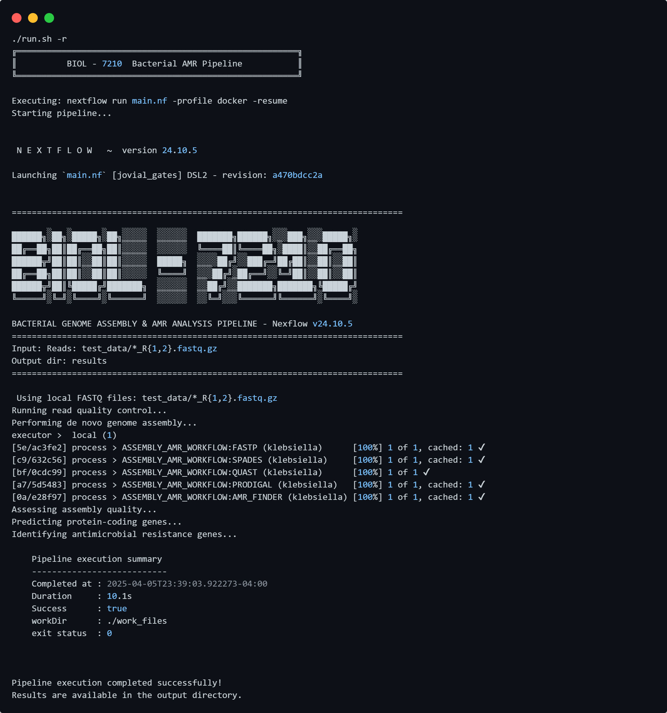

# Bacterial Genome Analysis & AMR Detection Pipeline

<div align="center">
  
</div>
<br>

<div align="center">
  <a href="https://www.nextflow.io/"></a>
  <a href="#"></a>
  <a href="#"></a>
    
  
</div>

---

A modular Nextflow pipeline for bacterial genome assembly and antimicrobial resistance (AMR) gene detection, developed as part of Georgia Tech's BIOL7210 Computational Genomics course.

## Pipeline Overview

This pipeline implements a simple streamlined workflow for bacterial genomics focused on assembly and AMR detection. It processes either local FASTQ files or retrieves data directly from NCBI's Sequence Read Archive (SRA).

### Key Features

- **Read Processing**
  - Quality control and adapter trimming with FASTP
  - Support for direct SRA data retrieval
  
- **Assembly & Analysis**
  - De novo genome assembly with SPAdes
  - Gene prediction using Prodigal
  - Assembly quality assessment with QUAST
  
- **AMR Detection**
  - Antimicrobial resistance gene identification with NCBI's AMRFinderPlus
  - Detailed AMR gene classification and analysis

- **Infrastructure**
  - Container-based execution using Docker/Singularity (Added this using docs)
  - Support for various compute environments (local, HPC, cloud) (HPC and cloud not tested)
  - Comprehensive logging and error handling

## DAG Workflow Diagram 
Diagram illustrating the pipeline's workflow, showing the sequence of processes and their dependencies. Obtained using Nextflow's built-in DAG visualization tool.

<div align="center">
  
</div>


## Requirements

- [Nextflow](https://www.nextflow.io/) (v24.10.0 or later)
- [Docker](https://www.docker.com/) or [Singularity](https://sylabs.io/singularity/)
- Computational resources:
  - Minimum: 4 CPU cores, 8GB RAM
  - Recommended: 8+ CPU cores, 12GB+ RAM for larger genomes

### Tested Environment

```bash
OS       : Ubuntu 20.04.6 LTS (WSL2 on Windows 10 x86_64)
Kernel   : 5.15.167.4-microsoft-standard-WSL2

CPU      : AMD Ryzen 7 7735HS with Radeon Graphics (16 cores @ 3.19GHz)
RAM      : 32 GB (Used: ~4.1 GB during test run)
Nextflow : v24.10.5
Java     : OpenJDK 22 (via Conda)
```

### Terminal Preview

<div align="left">
  
</div>


## Quick Start

### Setup

```bash
# Clone the repository
git clone https://github.com/yourusername/bacterial-amr-pipeline.git
cd bacterial-amr-pipeline

# Make setup and run scripts executable
chmod +x setup.sh run.sh

# Run the setup script to download required containers
setup.sh
```

### Basic Usage

```bash
# Run with test data (included Klebsiella pneumoniae dataset)
./run.sh

# Resume a previous run
./run.sh --resume

# Process SRA data directly
./run.sh --sra SRR10971381

# Use custom input data
./run.sh --reads "path/to/data/*_R{1,2}.fastq.gz"

# Run with custom resources
./run.sh --threads 16 --memory "32 GB"
```

### Advanced Usage

```bash
# Run with Singularity containers instead of Docker
./run.sh --profile singularity

# Run on a high-performance computing cluster
./run.sh --profile hpc

# Clean work directory before running
./run.sh --clean

# See all available options
./run.sh --help
```
### Docker Container (Optional) - May cause issues

You can also run the entire pipeline within a Docker container:

1. Build the Docker image:
```bash
# Dockerfile is located in the .docker directory
cd .docker
docker build -t biol7210-pipeline .
```

2. Run the pipeline with test data:
```bash
# Create a directory for results
cd ..
# Create a results directory to store output
mkdir -p results

# Run the pipeline with test data, mounting the results directory
docker run -v $(pwd)/results:/pipeline/results biol7210-pipeline
```

3. Run with SRA data:
```bash
docker run -v $(pwd)/results:/pipeline/results biol7210-pipeline --use_sra --sra_ids "SRR10971381"
```

4. Get help:
```bash
docker run biol7210-pipeline help
```

> [!CAUTION]
> This containerized approach includes Nextflow itself. Since the pipeline uses Docker for individual processes, this creates a Docker-in-Docker scenario which may require additional permissions. For simpler deployments, we recommend installing Nextflow directly on your system and using the standard execution commands.


## Input Options

### Local FASTQ Files

By default, the pipeline looks for paired-end reads in the `test_data/` directory. The expected naming convention is `*_R1.fastq.gz` and `*_R2.fastq.gz`. **The test data is in Git LFS due to size constraints, so ensure you have Git LFS installed to download the test data.**

```bash
# Specify a custom location
nextflow run main.nf --reads "/path/to/data/*_R{1,2}.fastq.gz"
```

### SRA Data Retrieval

For direct processing from NCBI's SRA database:

```bash
# Single accession
nextflow run main.nf --use_sra --sra_ids "SRR10971381"

# Multiple accessions (comma-separated)
nextflow run main.nf --use_sra --sra_ids "SRR10971381,SRR10971382"
```

### Test Data (More Info)

The included test data in the `test_data/` directory contains downsampled paired-end reads from *Klebsiella pneumoniae* (SRA accession: SRR32935048). **The test data is tracked using Git LFS (Large File Storage) due to file size constraints of standard Git repositories, so take into account the storage constraints, the test data is about ~450mb**. The reads have been downsampled to approximately 75% of the original dataset (~1,400,000 reads) using seqtk:

```bash
# Download the test data
prefetch SRR32935048
fasterq-dump --split-files --skip-technical SRR32935048
gzip -f SRR32935048_*.fastq

# Or remove the hard links before compressing (if any errors occur)
# rm -f SRR32935048_*.fastq.gz  # Remove any existing compressed files first
# gzip SRR32935048_*.fastq

rm -rf SRR32935048/

# Downsample the data to 75% of the original size
# Command used for downsampling (for reference)
seqtk sample -s160 SRR32935048_1.fastq.gz 0.75 > klebsiella_R1.fastq
seqtk sample -s160 SRR32935048_2.fastq.gz 0.75 > klebsiella_R2.fastq
gzip -f klebsiella_R1.fastq klebsiella_R2.fastq
rm -rf SRR32935048_*.fastq.gz
```
This downsampled dataset is provided solely for testing the pipeline functionality and should not be used for actual research purposes. For real analyses, please use full datasets or your own sequencing data.


## Output Structure

Results are organized in the `results/` directory:

```
results/
├── fastp/                   # Quality-filtered reads & QC reports
│   ├── reports/             # HTML & JSON quality reports
│   └── trimmed/             # Trimmed FASTQ files
├── assemblies/              # Assembled genomes (FASTA)
├── quast/                   # Assembly quality metrics
├── prodigal/                # Predicted genes
│   ├── proteins/            # Predicted protein sequences
│   ├── annotations/         # GFF annotation files
│   └── stats/               # Gene prediction statistics
├── amr_finder/              # AMR detection results
│   ├── results/             # Detailed AMR findings
│   └── summaries/           # AMR summary reports
├── sra_data/                # Downloaded SRA data (if applicable)
├── analysis_summary.txt     # Pipeline summary report
├── execution_report.html    # Nextflow execution report
├── execution_timeline.html  # Execution timeline visualization
├── execution_trace.txt      # Detailed trace of each process
└── pipeline_dag.svg         # Workflow visualization
```

## Configuration & Parameters

The pipeline behavior can be customized through various parameters:

### Resource Management

| Parameter | Description | Default |
|-----------|-------------|---------|
| `--cpus` | Number of CPU cores to use | `4` |
| `--memory` | Maximum memory allocation | `12 GB` |
| `--outdir` | Output directory | `results` |

### Data Input

| Parameter | Description | Default |
|-----------|-------------|---------|
| `--reads` | Pattern for input read files | `test_data/*_R{1,2}.fastq.gz` |
| `--use_sra` | Enable SRA data download | `false` |
| `--sra_ids` | Comma-separated list of SRA IDs | `""` |

### Tool Parameters

| Parameter | Description | Default |
|-----------|-------------|---------|
| `--fastp_min_length` | Minimum read length after trimming | `36` |
| `--fastp_cut_mean_quality` | Mean quality in sliding window | `20` |
| `--spades_mode` | Mode for SPAdes assembly | `isolate` |
| `--spades_careful` | Enable careful mode in SPAdes | `false` |
| `--quast_min_contig` | Minimum contig length for QUAST | `200` |
| `--prodigal_mode` | Genetic code for Prodigal | `meta` |
| `--amr_organism` | Taxonomy name for AMRFinder | `false` |
| `--amr_identity` | Minimum identity threshold | `0.9` |
| `--amr_coverage` | Minimum coverage threshold | `0.9` |

## Execution Environments

The pipeline supports multiple execution environments through profiles:

```bash
# Local execution with Docker (default)
nextflow run main.nf -profile docker

# Execution with Singularity
nextflow run main.nf -profile singularity

# High-performance computing cluster with SLURM
nextflow run main.nf -profile hpc

# AWS Batch execution
nextflow run main.nf -profile aws
```

## Troubleshooting

### Common Issues

1. **Container execution errors**
   - Ensure Docker or Singularity is properly installed and running
   - Run setup.sh to preload all required containers
   - Check Docker permissions (`sudo usermod -aG docker $USER`)

2. **Resource limitations**
   - For large genomes, increase available resources:
     ```bash
     nextflow run main.nf --cpus 16 --memory '32 GB'
     ```

3. **Path issues**
   - Nextflow may have issues with paths containing spaces or special characters
   - Use paths without spaces or properly quote them

4. **SRA download failures**
   - Ensure internet connectivity and sufficient disk space
   - For persistent issues, download SRA data manually and use as local input

### Resuming Failed Runs

To resume a failed run from the last successful process, use the following command:

```bash

./run.sh -r

```

If the run.sh script fails, use the following command:

```bash
nextflow run main.nf -resume
```

## Tools Used

- [Nextflow](https://www.nextflow.io/) - Workflow engine (DSL2)
- [FASTP](https://github.com/OpenGene/fastp) - Read quality control
- [SPAdes](https://cab.spbu.ru/software/spades/) - De novo assembly
- [QUAST](http://quast.sourceforge.net/quast) - Assembly quality assessment
- [Prodigal](https://github.com/hyattpd/Prodigal) - Gene prediction
- [AMRFinderPlus](https://github.com/ncbi/amr) - AMR gene detection
- [SRA-tools](https://github.com/ncbi/sra-tools) - SRA data retrieval

## Acknowledgements

This pipeline was developed as part of the **Georgia Tech's BIOL7210 - Computational Genomics** course. Special thanks to the **Nextflow community** for their excellent documentation and examples, which greatly supported this work.

I would also like to thank **[Dr. Christopher Gulvik](https://github.com/chrisgulvik)**, the instructor of the course, for his guidance and support throughout the coursework.

## Contact

For questions or issues specific to the repository, please submit an issue.
For collaboration inquiries or general questions, feel free to reach out:

**[Aaryesh Deshpande](https://www.linkedin.com/in/aaryesh-ad/)**  
MS Bioinformatics  
*[adeshpande334](mailto:adeshpande334@gatech.edu)*  

---